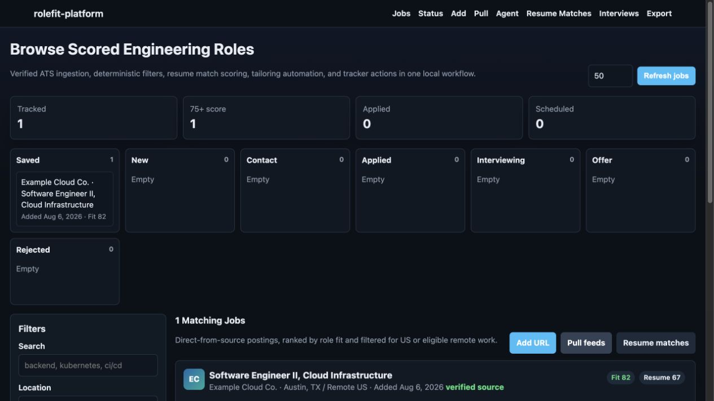
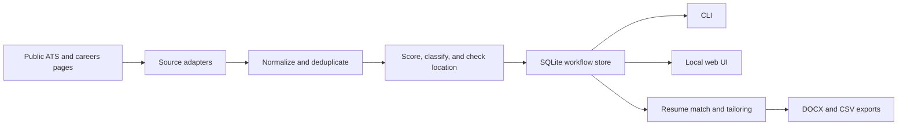

# RoleFit Platform

RoleFit Platform is an offline-first Python application for collecting public software-engineering job postings, applying deterministic fit rules, tracking opportunities in SQLite, and producing resume-matching and tailoring artifacts through a CLI and local web interface.

It does not use a hosted model or paid API. The scoring behavior is explicit and inspectable so results can be tested, explained, and changed without retraining a model.



## What it does

- Ingests public Greenhouse, Lever, Eightfold, Workday CXS, Ashby, and HTML career listings.
- Normalizes and deduplicates job records.
- Scores backend, platform, cloud, reliability, automation, and infrastructure signals.
- Stores jobs, statuses, notes, contacts, actual referral usage, explicit next actions, queue priorities, interviews, and tailoring snapshots in SQLite.

Referral usage is tracked separately from the referral/contact pipeline stage, so an applied job can record whether an employee referral was actually used. Optional next-action metadata remains available through the CLI and CSV export without adding a second workflow to the Status UI.
- Compares saved roles with a resume profile and exports tailored, ATS-safe DOCX files.
- Provides the same workflow through an `argparse` CLI and dependency-free local dashboard.

## Architecture



The application separates ingestion, scoring, persistence, presentation, and resume generation so each layer can be tested independently.

Resume exports use a machine-readable, single-column Word layout with standard section headings and no tables, text boxes, drawings, headers, or footers. Every job-specific export runs an ATS structure check before the dashboard reports success.

RoleFit distinguishes the resume used for matching from an editable canonical resume used to start job-specific forks. Both paths are environment-configurable and unset by default; when unset, RoleFit falls back to its built-in sample profile.

## Installation

Requirements: Python 3.10 or newer.

```bash
git clone https://github.com/bzhao-1/rolefit-platform.git
cd rolefit-platform
python3 -m venv .venv
source .venv/bin/activate
python3 -m pip install --upgrade pip
python3 -m pip install -e .
rolefit-platform --help
```

The application uses only the Python standard library at runtime.

## Quick start

Start the local dashboard:

```bash
rolefit-platform serve
```

Then open `http://127.0.0.1:8765`.

Use a repository-local database instead of the default user database:

```bash
rolefit-platform --db ./jobs.sqlite3 list-top
```

Classify the included example posting:

```bash
rolefit-platform classify-job \
  --company "Example Cloud Co." \
  --file examples/cloud_platform_job.txt
```

Pull a public Greenhouse board:

```bash
rolefit-platform pull-jobs \
  --greenhouse-board grafanalabs \
  --company "Grafana Labs" \
  --limit 20
```

Run one ingestion and scoring cycle:

```bash
rolefit-platform scrape-agent --once --limit 50
```

Set an explicit next action without changing role scoring:

```bash
rolefit-platform update-status 1 \
  --status "contact requested" \
  --next-action SEEK_REFERRAL \
  --queue-priority HIGH
```

Export tracked roles:

```bash
rolefit-platform export --output job_tracker_export.csv
```

## Scoring model

The scorer rewards explicit evidence of backend/platform ownership, distributed systems, cloud infrastructure, orchestration, reliability, deployment automation, testing, observability, security, and data pipelines. It also considers role level and location eligibility.

The output includes matched terms and category-level points. It is a deterministic heuristic, not a statistical prediction of whether an application will succeed.

## Development

Run the test suite:

```bash
python3 -m unittest discover -s tests -v
```

Compile all modules:

```bash
python3 -m compileall rolefit_platform
```

CI performs an editable package install, compilation check, and unit tests on Python 3.10 and 3.12.

## Current limitations

- Dynamic or guarded careers pages may require manual entry.
- Source adapters depend on public page/API formats and need regression fixtures when those formats change.
- The local server is designed for one trusted user, not public multi-user hosting.
- Scoring quality depends on explicit rules and representative evaluation examples.
- Network integrations are intentionally excluded from CI; parsers are tested with local fixtures.

## Repository layout

```text
rolefit_platform/
  sources.py         public source adapters
  scoring.py         deterministic role scoring
  classifier.py      priority classification
  storage.py         SQLite persistence and CSV export
  scraper_agent.py   repeated ingestion workflow
  resume_match.py    resume-to-role comparison
  resume_export.py   DOCX generation
  cli.py             command-line interface
  web.py             local browser interface
examples/
tests/
```

## Privacy

Local databases, generated resumes, and exports are ignored by Git. Review generated artifacts before sharing them.

## License

MIT. See [LICENSE](LICENSE).
